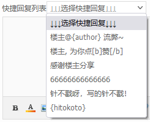
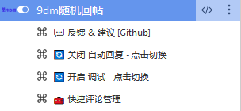
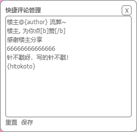
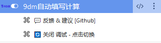
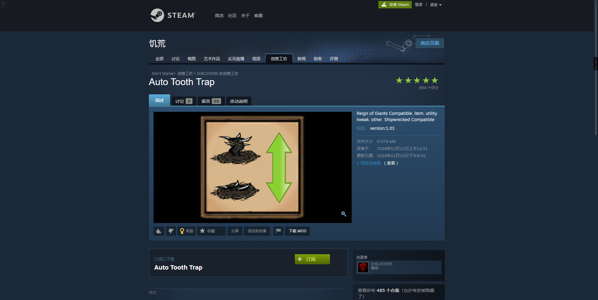
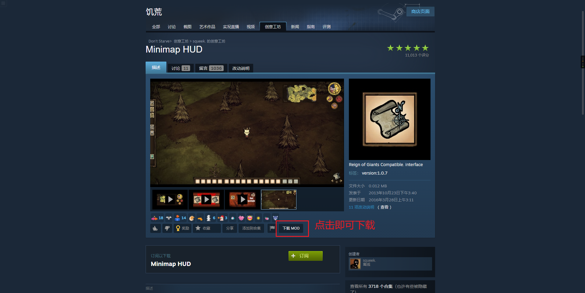

## Script‘s describe

自用脚本

## Script‘s details

| 分类(路径)       | 脚本名称                                                     | 描述                                                         | 安装                                                         |
| ---------------- | ------------------------------------------------------------ | ------------------------------------------------------------ | ------------------------------------------------------------ |
| 『分类』论坛辅助 |                                                              |                                                              |                                                              |
|                  | [9dm回帖辅助](./『分类』论坛辅助/9dm随机回帖.user.js)        | 功能:  1. 添加随机回复按钮 2. 添加快捷回复下拉框 [使用方法](#9dm回帖辅助) | [📥油猴](https://greasyfork.org/scripts/429335-9dm随机回帖/code/9dm随机回帖.user.js) \| [📥备用](https://cdn.jsdelivr.net/gh/ACG-Q/UserScript@main/『分类』论坛辅助/9dm随机回帖.user.js) |
|                  | [9dm每天计算](./『分类』论坛辅助/9dm自动填写计算.user.js)    | 功能:  1. 自动填写计算验证码 [使用方法](#9dm每天计算) | [📥油猴](https://greasyfork.org/scripts/429363-9dm自动填写计算/code/9dm自动填写计算.user.js) \|[📥备用](https://cdn.jsdelivr.net/gh/ACG-Q/UserScript@main/『分类』论坛辅助/9dm自动填写计算.user.js) |
| 『分类』下载辅助 |                                                              |                                                              |                                                              |
|                  | [Steam创意工坊mod下载工具](./『分类』下载辅助/Steam创意工坊mod下载工具.user.js) | 功能:  1. 下载单个创意工坊的MOD 2. 下载创意工坊的MOD合集(多个MOD) [使用方法](#Steam创意工坊mod下载工具) | 📥油猴 \|[📥备用](https://cdn.jsdelivr.net/gh/ACG-Q/UserScript@main/『分类』下载辅助/Steam创意工坊mod下载工具.user.js) |

## 🚩使用方法

<h3 id="9dm回帖辅助">9dm回帖辅助</h3>

#### 脚本HTML样式

##### 随机回复按钮

##### 快捷回复下拉框

##### 脚本菜单

> 如果想要自动回复, 需要点击<关闭 自动回复 - 点击切换>, 切换至<开启 自动回复 - 点击切换>
>
> 如果想要打印调试信息, 需要点击<关闭 调试 - 点击切换>, 切换至<开启 调试  - 点击切换>
>
> 如果想要管理评论, 需要点击<快捷评论管理>即可

#### 添加回复列表

> 点击<快捷评论管理>后

> 功能:
>
> 1. 支持窗口拖拽, 实时保存窗口位置
> 2. 右上角<X>, 关闭窗口
> 3. 左下角<重置>, 将评论重置到默认配置
> 4. 左下角<保存>, 将评论保存

#### 脚本使用方法

1. 开启了<自动回复>后, 点击<随机回复>按钮, 即可回复帖子
2. 开启了<自动回复>后, 选择<快捷回复列表>任意一项, 即可回复帖子
3. 如果没开, 这需要自行点击<回复>按钮

<h3 id="9dm每天计算">9dm每天计算</h3>

#### 脚本HTML样式

##### 脚本菜单

> 如果想要打印调试信息, 需要点击<关闭 调试 - 点击切换>, 切换至<开启 调试  - 点击切换>

#### 脚本使用方法

1. 安装完成后, 什么都不用管, 检测到验证码后自动计算并填写值.

<h3 id="Steam创意工坊mod下载工具">Steam创意工坊mod下载工具</h3>

#### 脚本HTML样式

#### 脚本使用方法

> 下载合集时会提示
> 
> 点击允许即可

## Notion's preview

[六记のBlog for Notion](https://ancient-range-c4d.notion.site/Blog-043421aa960340f2ad86f4a0d880cb62)

